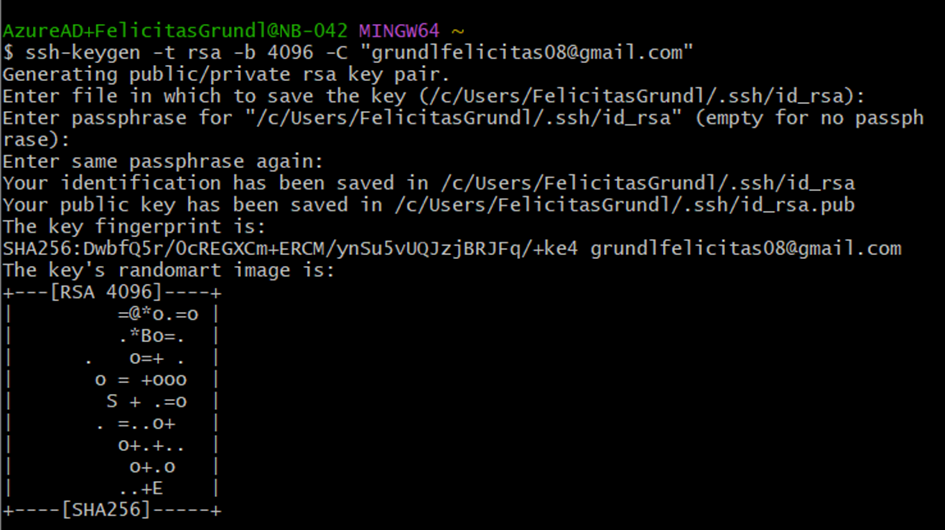
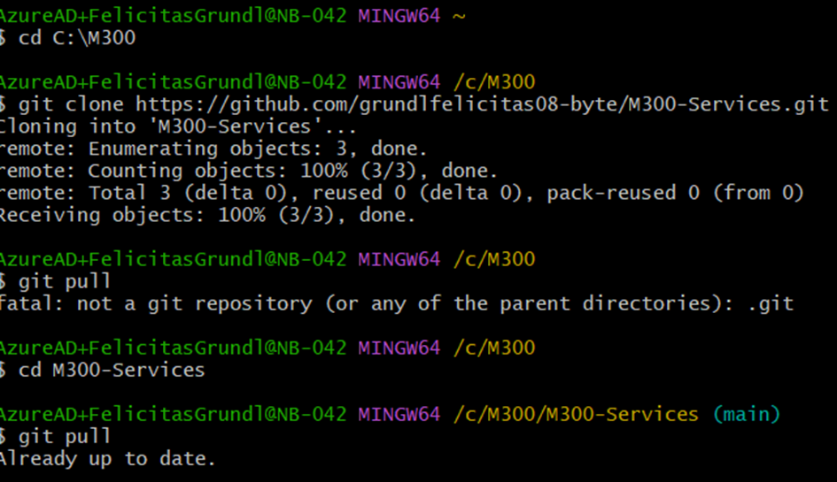
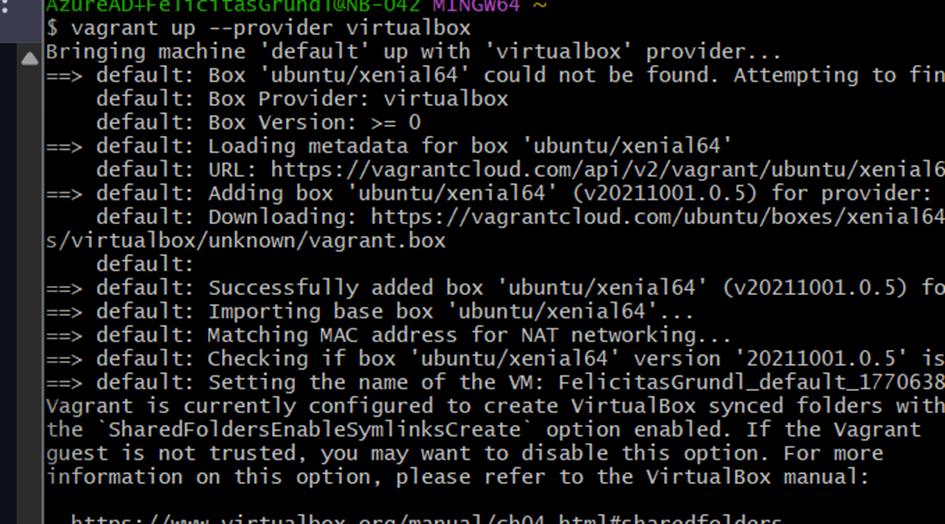
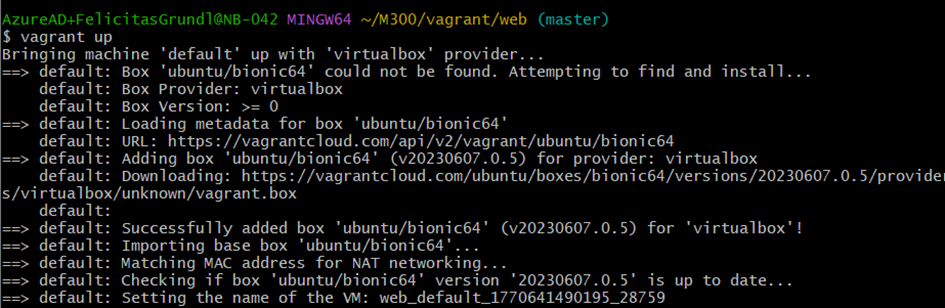
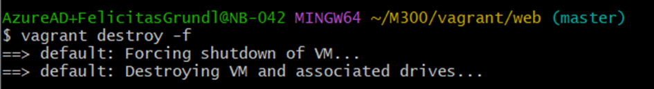
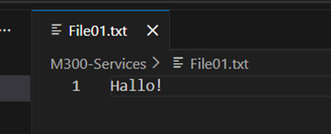

# 10 - ToolUmgebung
## 01 - GitHub Account
### Account + Repository erstellen

Zu aller erste erstellen wir unseren Github Account und erstelle dann unser erstes Projekt darin. Auf der Willkomensseite können wir ein Projekt  mit **"Start a project"** erstellen. Dann definieren wir einen Namen wie als bsp. M300-Services, optionalerweise kann man auch eine Beschreibung hinzufügen. Dann gehen wir weiter zu den Buttons, dort lassen wir denn Radio Button auf Public sodass andere Personen unsere gepushten Files anschauen können. Denn Haken bei **"Initialize this repository with a README"** setzen sodass man mahl das Base File hat. Dann nach kann man das Repository erstellen.

### SSH-Key erstellen (lokal)

Wenn noch nicht vorhanden Git/Bash installieren, dies ist eine Shell von Linux welche wir brauchen zum weiter arbeiten. Alternativ kann auch im Windows Powershell gearbeitet werden, ich habe hier mit Git/Bash gearbeitet.

| $  ssh-keygen -t rsa -b 4096 -C "xxx@gmail.com"                                                                 | Account Email von Github einfügen                  |
| --------------------------------------------------------------------------------------------------------------- | -------------------------------------------------- |
| Generating public/private rsa key pair.                                                                         | SSH-Key wird erstellt                              |
| Enter a file in which to save the key (~/.ssh/id_rsa): [Press enter]                                            | Name für Speicherung festlegen, Enter für Standard |
| Enter passphrase (empty for no passphrase): [Passwort]   Enter same passphrase again: [Passwort wiederholen] | Passwort festlegen für den Key                     |

### SSH-Key dem SSH-Agent hinzufügen

Nun brauchen wir den SSH Key welchen wir oben erstellt haben und kopieren ihn. Wir brauchen Ihn für den nächsten Schritt.

ssh-rsa AAAAB3NzaC1yc2EAAXXXXX......................== [grundlfelicitas08@gmail.com](mailto:grundlfelicitas08@gmail.com)

### SSH-Key hinzufügen

Jetzt brauchen wir wieder unser Github Konto, auf dem gehen wir jetzt auf unser Konto und rufen dann die **Settings** auf. Dann wechseln wir in dem Menubereich auf den Abschnitt **SSH und GPG keys**. Dann erstellen wir einen neuen SSH Key, im Fomular vergeben wir Titel und Bezeichnung. Dann fügen wir denn oben kopierten SSH Key ein und speichern den SSH Key ab.

## 02 - Git Client

Damit alles lokal gespeichert werden kann muss der **Git Client** installiert werden, der ermöglicht dann die Repositories sich zu klonen, zu pushen und zu pullen.
### Client installieren + konfigurieren
Die Installation herunterladen und durch klicken bis es fertig ist, nacher öffnen. Nacher müssen wir noch das Git konfigurieren mit den Infos des GitHub-Accounts.

| $ git config --global user.name "< xxx >"          | Username konfig |
| -------------------------------------------------- | --------------- |
| $ git config --global user.email "<xxx@gmail.com>" | Mail Konfig     |

*Fehler: aufpassen wenn man den Code kopiert das man die $ nicht mitnimmt*

### Repository klonen

Zum testen klonen wir jetzt ein Repository.

| $ git clone https://gitlab.com/xxx | Repository klonen                            |
| ---------------------------------- | -------------------------------------------- |
| $ cd M300                          | Ins Verzeichnis wechseln                     |
| $ git pull                         | Repository aktualisieren                     |
| $ git status                       | Repository Überprüfung mit dem Origin/Master |

### Repository herunterladen & aktualisieren (clone/pull)

| $ cd xxx                                        | Ins Verzeichnis wechseln  |
| -------------------------------------------------- | ------------------------- |
| $ mkdir xxx                                        | Ordner erstellen          |
| $ git clone git@github.com:<Mein Name>/my_M300.git | Repository mit SSH klonen |
| $ git pull                                         | Repository aktualisieren  |

### Repository hochladen (Push)

| $ cd xxx              | Ins Verzeichnis wechseln      |
| --------------------- | ----------------------------- |
| $ git add -A .        | Dateien dem Upload hinzufügen |
| $ git commit -m "xxx" | Upload commiten               |
| $ git push            | Upload pushen                 |

### Übersicht "How to Push"

| $  cd xxx              | Ins Verzeichnis wechseln                              |
| ---------------------- | ----------------------------------------------------- |
| $  git status          | Veränderte Dateien werden rot angezeigt               |
| $  git add -A          | Dateien werden zum Uplode hinzugefügt                 |
| $  git status          | Dateien sollten grün sein, alles ist ready zum upload |
| $  git commit -m "xxx" | Upload wird commitet                                  |
| $  git status          | Datein sind zum pushen bereit                         |
| $  git push            | Dateien werden gepusht                                |

## 03 - Virtualbox

Virtualisierung von Computersystemen, dazu gibt es viele Möglichkeiten wir nutzen hier jetzt mal Virtualbox.
### Software herunterladen/installieren + ISO Datei herunterladen
Zuerst müssen wir uns Virtualbox herunterladen und danach die Installation durchklicken. Danach müssen wir die ISO noch herunterladen, wir nehmen Ubuntu Desktop. Auch herunterladen und abspeichern. Nacher weiter gehen zu VM erstellen.

### VM erstellen

Jetzt erstellen wir die VM, wichtig ist das man alle Infos schon von Anfang hat sodass die Erstellung einfacher ist.

|  | VM Name festlegen / Speicherort / ISO Datei angeben      |
| ------------------------------------ | -------------------------------------------------------- |
|  | Benutzername / Passwort / Hostname / Domainame   angeben |
|  | Speicher / CPUs / Grösse angeben                         |
|  | Kontrolle                                                |
|  | VM starten, kann lange dauern                            |
|  | VM beendet letzte Einstellungen                          |
|  | Fertig, VM ist ready                                     |

### VM einrichten

Die VM ist jetzt fertig und ready zum genutz werden. Hier arbeiten wir weiterhin mit dem Terminal (Bash).

| $  sudo apt-get update        | Update liste aufrufen                                   |
| ----------------------------------------- | ------------------------------------------------------- |
| $  sudo apt-get upgrade                   | Bereits installierte Pakete werden auf Upgrades geprüft |
| $  sudo reboot                            | Neustart                                                |
| $  sudo apt-get install xxx               | App / Programm installieren                             |

Zuerst installieren wir Synaptic über Bash danach starten wir denn Synaptic Package Manger und starten ihn. Dann suchen wir innerhalb des Synaptic Package Manger nach apache oder auch dem Webserver Programm, und installieren ihn. Danach ein System Neustart durchführen. Dann im Web Browser mit http:127.0.0.01:80 (localhost) testen ob er erreichbar ist. Nacher VM wieder herunterfahren.

*Fehler: Aufpassen mit https und http*
## 04 - Vagrant

Da Virtualbox relativ lang dauert und es einige Möglichkeiten gibt wie es einfacher ist, nehmen wir noch einen leichtere und schnellere Option. Hier kommt Vagrant ins Spiel.

### Software herunterladen / installieren + VM erstellen

Wir laden die Anwendung wieder von der Webseite herunter und gehen die Installation durch. Nacher erstellen wir unsere erste VM in Vagrant.

| $ cd xxx                        | Ins Verzeichnis wechseln |
| ---------------------------------- | ------------------------ |
| $ mkdir xxx                        | Ordner erstellen         |
| $ vagrant init ubuntu/xenial64     | Vagrantfile erstellen    |
| $ vagrant up --provider virtualbox | VM erstellen + starten   |
VM ist nun in Betrieb und kann via SSH Zugriff bedient werden.

| $ cd xxx/Vagrant-VM | Ins Verzeichnis wechseln |
| ------------------- | ------------------------ |
| $ vagrant ssh       | SSh verbindung zur VM    |

### VM erstellen (Vagrant Box auf Netzwerkshare)

| $ cd xxx                        | Ins Verzeichnis wechseln |
| ---------------------------------- | ------------------------ |
| $ mkdir xxx                        | Ordner erstellen         |
| $ vagrant init ubuntu/xenial64     | Vagrantfile erstellen    |
| $ vagrant up --provider virtualbox | VM erstellen + starten   |
| $ cd xxx/Vagrant-VM                | Ins Verzeichnis wechseln |
| $ vagrant ssh                      | SSh verbindung zur VM    |
Schlussfolgerung keinen Unterschied zum ersten.

### Apache Webserver automatisiert aufsetzen

Um den Automatisierungsgrad hervorzuheben, erstellen wir eine VM die mit einem Apache Webserver startet.

| $ cd xxx             | Ins Verzeichnis wechseln |
| -------------------- | ------------------------ |
| $ vagrant up         | VM starten               |
| $ vagrant destroy -f | VM löschen               |
Nachdem wir die VM geöffnet haben schauen wir auf http://127.0.0.01:8080 (localhost) ob die Webseite erreichbar ist. Nacher noch probiern etwas zum ändern zum die Veränderung zu sehen. Anschliessend wieder löschen.

## 05 - Visual Studio Code

Als nächstes brauchen wir eine Entwicklungsumgebung die es ermöglicht alle Repositories an einem Ort zu verwalten. Genau das ermöglicht Visual Studio Code. Dies haben wir bereits mehrfach im Unterricht verwendet. Zusätzliche Extensions noch installieren.

### Einstellungen anpassen

Unter File > Preferences > Settings (Ctrl +, ) auf Open Settings klicken. Zu dem Abschnitt mit "Configure glob Patterns..." den nachstehenden Code einfügen und speichern.

### Repository hinzufügen und pushen

Eine Datei fertig bearbeiten, mit ctrl + s speichern, dann in der linken Seite das Symbol mit einer 1 aufrufen. Im Abschnitt "Changes" die files stagen (aufs + drücken) dann eine Naricht hinter lassen bsp was für ein commit es ist. (Bsp Test01Speicher) Nacher commiten und bei den 3 Punkten pushen, warten bis alle Dateien vollständig gepusht wurden.

# 20 - Infrastruktur

